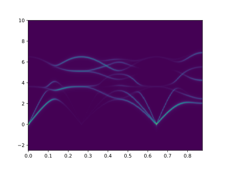

# UPHO

[](https://github.com/yuzie007/upho/actions?query=workflow%3ATests)

Band unfolding for phonons (http://yuzie007.github.io/upho/)

## Requirements

- numpy
- h5py
- phonopy>=2.7.0

## Install

```bash
pip install git+https://github.com/yuzie007/upho.git@v0.6.5
```

## Usage and Tutorial

Here we consider the hypothetical case when Cu<sub>3</sub>Au with the L1<sub>2</sub> structure is regarded as a random configuration of the A1 (fcc) structure. You can find the input files in the `examples` directory.

1.  Create `FORCE_SETS` file for the structure (maybe including disordered chemical configuration)
    you want to investigate using ``phonopy`` in a usual way.
    Be careful that the number of the structures with atomic displacements to get `FORCE_SETS` can be huge (>100)
    for a disordered configuration.

2.  Create `FORCE_CONSTANTS` file from `FORCE_SETS` file using `phonopy` as
    ```
    phonopy writefc.conf
    ```
    where `writefc.conf` is a text file like
    ```
    FORCE_CONSTANTS = WRITE
    DIM = 2 2 2
    ```
    ``DIM`` must be the same as that what you used to get `FORCE_SETS`.

3.  Prepare two VASP-POSCAR-type files, `POSCAR` and `POSCAR_ideal`.
    POSCAR includes the original chemical configuration, which may be disordered.
    ```
    Cu Au
       1.00000000000000
         3.7530000000000001    0.0000000000000000    0.0000000000000000
         0.0000000000000000    3.7530000000000001    0.0000000000000000
         0.0000000000000000    0.0000000000000000    3.7530000000000001
       Cu   Au
         3     1
    Direct
      0.0000000000000000  0.5000000000000000  0.5000000000000000
      0.5000000000000000  0.0000000000000000  0.5000000000000000
      0.5000000000000000  0.5000000000000000  0.0000000000000000
      0.0000000000000000  0.0000000000000000  0.0000000000000000
    ```
    Note that although `FORCE_CONSTANTS` may be obtained using relaxed atomic positions,
    here the positions must be the ideal ones.

    `POSCAR_ideal` is the ideal configuration, from which the crystallographic symmetry is extracted.
    ```
    X
        1.00000000000000
            3.7530000000000001    0.0000000000000000    0.0000000000000000
            0.0000000000000000    3.7530000000000001    0.0000000000000000
            0.0000000000000000    0.0000000000000000    3.7530000000000001
        X
            4
    Direct
        0.0000000000000000  0.5000000000000000  0.5000000000000000
        0.5000000000000000  0.0000000000000000  0.5000000000000000
        0.5000000000000000  0.5000000000000000  0.0000000000000000
        0.0000000000000000  0.0000000000000000  0.0000000000000000
    ```
    In this file I recommend to  use dummy symbols like 'X' to avoid confusion.

4.  Prepare ``band.conf`` file including something like
    ```
    DIM =  2 2 2
    PRIMITIVE_AXIS =  0 1/2 1/2  1/2 0 1/2  1/2 1/2 0
    BAND =   0 0 0  0 1/2 1/2, 1 1/2 1/2  0 0 0  1/2 1/2 1/2
    BAND_POINTS = 101
    BAND_LABELS =  \Gamma X \Gamma L
    FORCE_CONSTANTS = READ
    ```
    The style is very similar to that of phonopy conf files, but be careful about the following tags.

    - `DIM` describes the expansion from the original POSCAR to the POSCARs with atomic displacements used to get `FORCE_SETS`.
    Therefore, this should be the same as the phonopy option when creating the structures with atomic displacements (1).

    - `PRIMITIVE_AXIS` is the conversion matrix from `POSCAR_ideal` to the primitive cell you expect.

    **Since v0.6.2:** We can also use `BAND = AUTO` like
    ```
    DIM =  2 2 2
    PRIMITIVE_AXIS =  0 1/2 1/2  1/2 0 1/2  1/2 1/2 0
    BAND = AUTO
    BAND_POINTS = 101
    FORCE_CONSTANTS = READ
    ```
    Internally, this uses [SeeK-path](https://seekpath.readthedocs.io/en/latest/) via phonopy.

4.  Run
    ```
    upho_weights band.conf
    ```
    You hopefully get `band.hdf5` file. Note that this file can be in the order of GB.

5.  Run
    ```
    upho_sf --fpitch 0.01 -s 0.05 --function lorentzian --format text
    ```
    You hopefully get `sf_E1.dat`, `sf_E2.dat`, and `sf_SR.dat` files.
    In these files:
    - `1st column`: distance in the reciprocal space
    - `2nd column`: frequencies
    - `3rd column`: values of spectral functions

    Further

    - `sf_E1.dat` has the element-pair-resolved spectral functions.
    - `sf_E2.dat` has the element-resolved spectral functions.
    - `sf_SR.dat` has the spectral functions decomposed by the small representations.

6.  Plot the spectral functions. You can refer to `plot.py` in the example directory. Hopefully you get the figure like below:

    

## Options (`upho_weights`)

### `--average_masses`

Atomic masses whose sites are equivalent in the underlying structure
are averaged.

### `--average_force_constants`

FC elements which are equivalent under the symmetry operations
for the underlying structure are averaged.

## Options (`upho_sf`)

### `-f FILENAME`, `--filename FILENAME`

Filename for the data of weights.

### `--format {hdf5,text}`

Output file format.

### `--function {gaussian,lorentzian}`

Function used for the smearing.

### `-s SIGMA`, `--sigma SIGMA`

Parameter for the smearing function (THz).
For Gaussian, this is the standard deviation.
For Lorentzian, this is the HWHM (gamma).

### `--fmax FMAX`

Maximum frequency (THz).

### `--fmin FMIN`

Minimum frequency (THz).

### `--fpitch FPITCH`

Frequency pitch (THz).

### `--squared`

Use squared frequencies instead of raw frequencies.

## Not yet (possible bugs)

(Projective) representations of little cogroup may be treated in a wrong way
when we consider wave vectors on the BZ boundary and translational parts of
symmetry operations are not equal to zero.

## Author(s)

Yuji Ikeda (yuji.ikeda.ac.jp@gmail.com, Universität Stuttgart, Germany)

## How to cite

When using this code, please cite the following article.

    *Mode decomposition based on crystallographic symmetry in the band-unfolding method*,
    Yuji Ikeda, Abel Carreras, Atsuto Seko, Atsushi Togo, and Isao Tanaka,
    Phys. Rev. B **95**, 024305 (2017).
    http://journals.aps.org/prb/abstract/10.1103/PhysRevB.95.024305

For high entropy alloy works, you can also consider

    *Phonon Broadening in High Entropy Alloys*,
    Fritz Körmann, Yuji Ikeda, Blazej Grabowski, and Marcel H. F. Sluiter,
    Npj Comput. Mater. **3**, 1 (2017).
    https://www.nature.com/articles/s41524-017-0037-8
