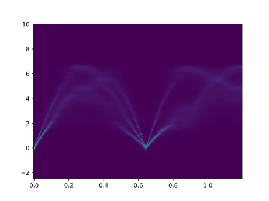

# Example for a disordered-alloy model

Here we consider a bit more practical case when Cu<sub>0.75</sub>Au<sub>0.25</sub> with the A1 (FCC) structure is modeled using a supercell model.

1.  Prepare two VASP-POSCAR-type files, `POSCAR` and `POSCAR_ideal`.

    `POSCAR` includes the original chemical configuration, which may be disordered.
    ```
    Cu Au
     1.0000000000000000
        11.2590000000000003    0.0000000000000000    0.0000000000000000
         0.0000000000000000   11.2590000000000003    0.0000000000000000
         0.0000000000000000    0.0000000000000000   11.2590000000000003
     Cu  Au 
      81  27
    Direct
      0.0005745466020530  0.0006622413878287 -0.0000462844433759
      0.6680892494574818 -0.0013629019985120  0.3295756612905684
      0.8277767934221298  0.1643677436873781 -0.0008634774543910
      0.6665436022106727  0.1669710199760064  0.1658642070302083
    ...
    ```

    `POSCAR_ideal` is the ideal configuration, from which the crystallographic symmetry is extracted.
    ```
    X
     1.0000000000000000
        11.2590000000000003    0.0000000000000000    0.0000000000000000
         0.0000000000000000   11.2590000000000003    0.0000000000000000
         0.0000000000000000    0.0000000000000000   11.2590000000000003
     X
     108
    Direct
      0.0000000000000000  0.0000000000000000  0.0000000000000000
      0.0000000000000000  0.1666666666666667  0.1666666666666667
      0.1666666666666667  0.0000000000000000  0.1666666666666667
      0.1666666666666667  0.1666666666666667  0.0000000000000000
    ...
    ```
    In this file I recommend using dummy symbols like `X` to avoid confusion.

2. Create `FORCE_CONSTANTS` file using phonopy etc.
   The script `pre1.py` contains how to do using phonopy Python API together with ASE.

3.  Prepare ``band.conf`` file including something like
    ```
    DIM =  1 1 1
    PRIMITIVE_AXIS =  0 1/6 1/6  1/6 0 1/6  1/6 1/6 0
    BAND =   0 0 0  0 1/2 1/2, 1 1/2 1/2  0 0 0  1/2 1/2 1/2
    BAND_POINTS = 101
    BAND_LABELS =  \Gamma X \Gamma L
    FORCE_CONSTANTS = READ
    ```
    The style is very similar to that of phonopy conf files, but be careful about the following tags.

    - `DIM` describes the expansion from `POSCAR` to the POSCARs with atomic displacements used to get `FORCE_SETS` and/or `FORCE_CONSTANTS`.
    In the present case, since `POSCAR` is already a 108-atom supercell model and since `FORCE_CONSTANTS` corresponds to this supercell model,
    we should give `DIM =  1 1 1`.

    - `PRIMITIVE_AXIS` is the conversion matrix from `POSCAR_ideal` to the primitive cell you expect.
    In the present case, we need to map from the 108-atom supercell to the 1-atom primitive cell, this tag should be as given above.

    We can also use `PRIMITIVE_AXES = AUTO` and `BAND = AUTO` like
    ```
    PRIMITIVE_AXES = AUTO
    BAND = AUTO
    BAND_POINTS = 101
    FORCE_CONSTANTS = READ
    ```
    Internally, this uses [SeeK-path](https://seekpath.readthedocs.io/en/latest/) via phonopy.

4.  Run
    ```
    upho_weights band.conf
    ```
    You hopefully get `band.hdf5` file. Note that this file can be in the order of GB.

5.  Run
    ```
    upho_sf --fpitch 0.01 -s 0.05 --function lorentzian --format text
    ```
    You hopefully get `sf_E1.dat`, `sf_E2.dat`, and `sf_SR.dat` files.
    In these files:
    - `1st column`: distance in the reciprocal space
    - `2nd column`: frequencies
    - `3rd column`: values of spectral functions

    Further

    - `sf_E1.dat` has the element-pair-resolved spectral functions.
    - `sf_E2.dat` has the element-resolved spectral functions.
    - `sf_SR.dat` has the spectral functions decomposed by the small representations.

6.  Plot the spectral functions. You can refer to `plot.py` in this directory.
    Hopefully you get the figure like below:

    
